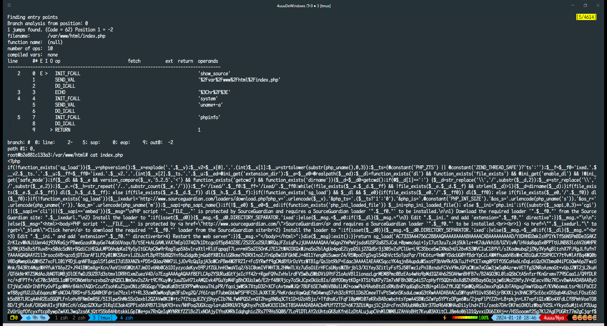

# php源码加密还原

一共做了4个镜像，分别对应三种hook方式，hook基于vld进行修改

- compile_string
- compile_file
- execute_ex

包含4种加密方式，其中php-beast和php-screw的解密方式完全一样，所以 `compile_file` 做在了 `beast` 镜像中

- phpjiami.com
- php-beast
- php-screw
- SourceGuardian11.4.1

所有加密文件原始代码均为

```php
<?php
    show_source(__FILE__);
    echo '<hr/>';
    system('uname -a');
    phpinfo();
```


## 使用说明

```bash
docker compose up -d --build
```

### ast.dockerfile

基础镜像为 `php:7.3-apache`，启动后访问目标web

- index.php 加密后文件
- index.hook hook加密后文件，在页面中输出原始代码

镜像中放了一个 `ast.php`，运行 `ast.php` 会生成两个文件

- out.ast
    - index.php文件对应的AST
- out.php
    - 使用php-parser对index.php文件进行符号与可读性恢复后的文件

可以通过下面的命令进入容器后使用

```bash
docker compose exec ash bash
root@host:/var/www/html# php ast.php
```

### beast.dockerfile

使用方法同上

### screw.dockerfile

仅做 `screw` 扩展加密演示用，没有包含任何解密操作，hook解密方式与 `beast` 相同

### sg11.dockerfile

需要进入容器使用

```bash
docker compose exec sg11 bash
root@host:/var/www/html# php -dvld.active=1 -dvld.execute=0 index.php
```

之后会打印目标文件的opcode，如下所示

